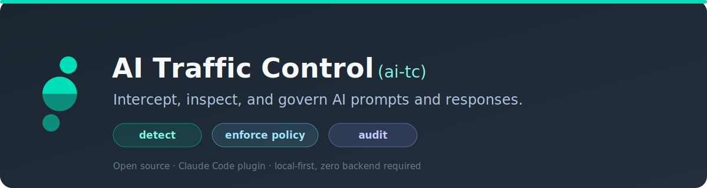

<p align="center"></p>

# AI Traffic Control

**AKA Security — We secure agent harnesses at the source.**

AI Traffic Control (`ai-tc`) is an open-source control plane for coding agents. It watches an agent session's traffic (prompts, tool calls, responses, file reads), scans each event against your rule packs, and decides what happens next: monitor, warn, redact, block, or a manual exception. Secrets and regulated data like PCI, PHI, and PII are caught and kept on your machine, not sent to a model or a third party.

`ai-tc` is the detection engine. For harness posture — safe-default permissions, structural command guards, and credential deny rules for Claude Code — pair it with [claude-tools](https://github.com/akasecurity/claude-tools). The two compose: posture from claude-tools, detection from ai-tc.


[](https://akasecurity.io)

## How it works

Every event in a session runs through one control point before it takes effect:

```
prompt · tool call · response · file read   →   ai-tc policy engine   →   monitor · warn · redact · block · exception
```

Prompts and tool inputs are checked before they reach the model; tool outputs and file reads are checked after it responds. Each event is scanned against your installed rule packs, every match becomes a finding (rule id, category, severity, matched span), and policy decides the outcome. Everything is logged.

Detection is mostly regex, patterns shaped like an AWS access key, an email address, or a bank routing number, which covers most secrets and PII since they have a predictable shape. A smaller set of rules match on keyword, and some regex matches run through a validator, such as a Luhn checksum for card numbers or a Shannon-entropy check for high-entropy secrets, to cut false positives.

### Policy outcomes

A finding resolves to one of five outcomes:

| Outcome       | What happens                                                                                                       |
| ------------- | ------------------------------------------------------------------------------------------------------------------ |
| **Monitor**   | Logged only. Every rule ships active here, so nothing is enforced until you promote it.                            |
| **Warn**      | Surfaces a warning in the session; the content still goes through unchanged.                                       |
| **Redact**    | The matched value is replaced in place before it reaches the model. Tool inputs and outputs only, not prompt text. |
| **Block**     | The prompt or tool call is stopped, with a message explaining what fired.                                          |
| **Exception** | A manually granted, exact-value override that lets one specific match through despite its rule's policy.           |

Promote any detection from monitor to warn, redact, or block from the dashboard, per rule or per category.

## Key concepts

| Term          | What it is                                                                                           |
| ------------- | ---------------------------------------------------------------------------------------------------- |
| **Event**     | A prompt, response, tool call, or file read captured from an agent session.                          |
| **Finding**   | A rule match produced by the detection engine against an event.                                      |
| **Rule**      | A JSON file describing what to detect: a keyword list, a regex pattern, or a validator.              |
| **Rule pack** | A directory of rules and their fixtures with a `manifest.json`.                                      |
| **Policy**    | The decision about what to do when a rule or category fires.                                         |
| **Plugin**    | The harness extension that intercepts sessions. One package, used by Claude Code and Claude Desktop. |

## Install

`ai-tc` installs as a plugin through the AKA marketplace.

### Claude Code

In Claude Code:

```bash
/plugin marketplace add akasecurity/marketplace
/plugin install ai-tc@akasecurity
```

### Claude Desktop

Claude Desktop is supported too; the [installation guide](https://akasecurity.github.io/ai-tc-docs/getting-started/installation/) covers both. `ai-tc` runs locally alongside your agent. There's no backend to stand up, and nothing leaves your machine to scan it.

## Docs

Full documentation, architecture, and the built-in detection catalog live at **[akasecurity.github.io/ai-tc-docs](https://akasecurity.github.io/ai-tc-docs/)**.

- [How it works](https://akasecurity.github.io/ai-tc-docs/getting-started/how-it-works/)
- [Architecture overview](https://akasecurity.github.io/ai-tc-docs/architecture/overview/)
- [Writing rules](https://akasecurity.github.io/ai-tc-docs/rules/writing-rules/)
