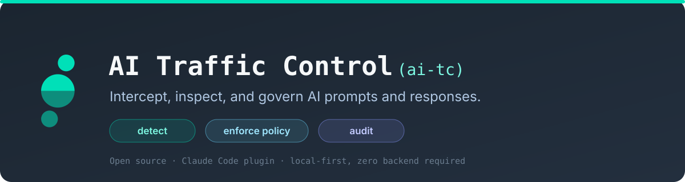

<p align="center"></p>

# AI Traffic Control

**AKA Security — We secure agent harnesses at the source.**

AI Traffic Control (`ai-tc`) is an open-source control plane for coding agents. It watches an agent session's traffic (prompts, tool calls, responses, file reads), scans each event against your rule packs, and decides what happens next: monitor, warn, redact, block, or a manual exception. Secrets and regulated data like PCI, PHI, and PII are caught locally: live detection and enforcement never send them to a model or a third party. The one exception is the opt-in `/aka:setup` calibration, which does send what its history scan finds to the model API to be rated.[^egress]


[](https://akasecurity.io)

`ai-tc` works standalone, and governs what a session carries: rule packs, findings, policy, and an audit trail, across Claude Code and Claude Desktop. To harden the harness itself — safe-default permissions, structural command guards, and credential deny rules for Claude Code — pair it with [claude-tools](https://github.com/akasecurity/claude-tools). They compose: claude-tools hardens the harness, `ai-tc` governs the traffic.

## How it works

Every event in a session runs through one control point before it takes effect:

```
prompt · tool call · response · file read   →   ai-tc policy engine   →   monitor · warn · redact · block · exception
```

Prompts and tool inputs are checked before they reach the model; tool outputs and file reads are checked after it responds. Each event is scanned against your installed rule packs, every match becomes a finding (rule id, category, severity, matched span), and policy decides the outcome. Everything is logged.

Detection is mostly regex, patterns shaped like an AWS access key, an email address, or a bank routing number, which covers most secrets and PII since they have a predictable shape. A smaller set of rules match on keyword, and some regex matches run through a validator, such as a Luhn checksum for card numbers or a Shannon-entropy check for high-entropy secrets, to cut false positives.

### Policy outcomes

A finding resolves to one of five outcomes:

| Outcome       | What happens                                                                                                       |
| ------------- | ------------------------------------------------------------------------------------------------------------------ |
| **Monitor**   | Logged only. Every rule ships active here, so nothing is enforced until you promote it.                            |
| **Warn**      | Surfaces a warning in the session; the content still goes through unchanged.                                       |
| **Redact**    | The matched value is replaced in place before it reaches the model. Tool inputs and outputs only, not prompt text. |
| **Block**     | The prompt or tool call is stopped, with a message explaining what fired.                                          |
| **Exception** | A manually granted, exact-value override that lets one specific match through despite its rule's policy.           |

Promote any detection from monitor to warn, redact, or block from the dashboard, per rule or per category.

## Key concepts

| Term          | What it is                                                                                           |
| ------------- | ---------------------------------------------------------------------------------------------------- |
| **Event**     | A prompt, response, tool call, or file read captured from an agent session.                          |
| **Finding**   | A rule match produced by the detection engine against an event.                                      |
| **Rule**      | A JSON file describing what to detect: a keyword list, a regex pattern, or a validator.              |
| **Rule pack** | A directory of rules and their fixtures with a `manifest.json`.                                      |
| **Policy**    | The decision about what to do when a rule or category fires.                                         |
| **Plugin**    | The harness extension that intercepts sessions. One package, used by Claude Code and Claude Desktop. |

## Where your data lives

`ai-tc` keeps what it records in a local SQLite store at `~/.aka/data/aka.db`, with your settings beside it under `~/.aka/settings`. There is no database server to run and no schema to manage — the CLI, the plugin, and the dashboard all read and write that one file.

That store is a running log of your agent sessions: prompts, responses, tool calls. What gets masked in it follows the policy assigned to the detection that flagged the span: a flagged span is masked at rest only where that policy is redact or block. Under monitor or warn the value is stored as it was seen, and everything outside a flagged span is stored verbatim and unencrypted either way. Every detection ships on monitor, so on a default install nothing is masked at all and `aka.db` builds up a full local record of what your agent saw, raw secrets included; promoting a detection changes what is stored from then on, not what is already there. Files read by `aka scan` are stored under the same rule. On macOS and Linux the store directories are created owner-only (`0700`) and the files are written `0600`. Those permissions are the only at-rest control there is, and they do nothing on Windows.

That stored content is also what an attached machine sends. `aka attach` registers a machine against a control plane your organization runs — not a service AKA operates — and from then on the plugin forwards each captured event to that deployment as it stored it, so the masking rule above is also the rule for what crosses the network: under monitor or warn the matched value reaches that deployment unmasked, and promoting the detection to redact or block masks it before it is stored and so before it is sent. Every detection ships on monitor, so on an attached machine that is the default posture rather than an edge case. A machine you have not attached forwards none of this.[^egress]

**[SECURITY.md](SECURITY.md)** has the full picture — every file the store spans, what an attached machine forwards, what to do on Windows, and how to report a vulnerability.

## Install

`ai-tc` installs as a plugin through the AKA marketplace.

### Claude Code

In Claude Code:

```bash
/plugin marketplace add akasecurity/marketplace
/plugin install ai-tc@akasecurity
```

### Claude Desktop

Claude Desktop is supported too; the [installation guide](https://akasecurity.github.io/ai-tc-docs/getting-started/installation/) covers both. `ai-tc` runs locally alongside your agent. Standalone by default: there's no backend to stand up, and no scanning happens off your machine.[^egress]

[^egress]: Detection and enforcement run locally — no AKA server and no account unless you attach to one. Five narrow paths can reach the network. Four of them are child processes: the passive **update notice**, which is on by default and needs no command — after a run, when stdout is a terminal, a stale cache makes `aka` look up three package versions with `npm view` (`--no-update-check` skips it, and `cli/README.md` details what the registry learns); package-manager installs/updates (`npm`/`claude`/`codex`); the plugin's `npm audit signatures` supply-chain check; and the **opt-in** `/aka:setup` calibration. That last one is the only one of those four that carries your data, and the only path anywhere that sends it to a model: to rate false positives and severity, its judge step sends what an initial history scan finds — for each finding, the raw unmasked value including any secret, roughly 120 characters of the surrounding transcript text on either side (re-scanned before it goes, so every secret the rules detect in that window is masked, including the finding's own value where it appears there), the finding's rule, category, severity, masked value and confidence, and a sequential counter the model echoes back so its verdict can be matched to the finding — to the model API through the `claude` CLI. The source file's path is not sent. That's the same model provider your agent already uses, reached with your own credentials, and it takes **two** separate opt-ins: one to read your history at all, and a second, distinct grant to send what was found. Without that second grant the judge does not run. Each is revocable on its own under the dashboard's Settings, which stops future scans — data already sent cannot be recalled. The fifth is **opt-in and off unless you turn it on**, and it is the other path that carries your data: `aka attach` registers this machine against an AKA deployment your organization runs, after which the plugin forwards the activity that deployment is entitled to see and pulls the policy it sets. That covers activity from the moment you attach. What this machine has NOT delivered is a **separate opt-in**: `aka attach` asks about it once, it defaults to no, and `aka sync-history --on`/`--off` changes the answer later. It covers two things, sent alike. The first is the activity already recorded BEFORE the attachment: which sessions ran and when, in which project, repo and branch, token usage and model per call, which tools were called with their inputs truncated and every detected secret already masked, what AKA detected in those inputs, and the prompts, assistant replies and tool results themselves. The second is anything the live path could not deliver because the deployment was unreachable or refused the key. Either way, for a **captured** prompt, assistant reply or tool result, what is sent **includes its text**. What is masked in that text follows the policy assigned to the detection that flagged the value, exactly as it does at rest: masked only where that policy is redact or block, and under monitor or warn the matched value crosses as it was seen, as does everything outside a flagged span. Every detection ships on monitor, so on a default install nothing in that text is masked. The live path already sends exactly that, and always has — what this opt-in changes is whether an undelivered one is kept and retried or simply dropped, which is what every release before it did. So declining does not stop activity being sent from the attachment onwards; that is part of being attached. It sends in the background over later sessions, and what has been sent cannot be recalled. It is the one path with a network client in the source — `@akasecurity/remote`, the only package permitted to open a socket — and it does nothing until both an endpoint and an access key are on disk. `aka status` says what a machine is attached to and `aka detach` ends it, after which that deployment is sent nothing (the four child-process paths above are unaffected either way). Separately, and not one of the five: the `aka` CLI dispatches an unrecognized subcommand git-style, so `aka <name>` runs an `aka-<name>` program from your own `PATH` (POSIX only; a built-in always wins). That program is yours, not ours — `ai-tc` does not bundle, pin or verify it — so whether it reaches the network is its business, not something this project can describe.

## Docs

Full documentation, architecture, and the built-in detection catalog live at **[akasecurity.github.io/ai-tc-docs](https://akasecurity.github.io/ai-tc-docs/)**.

- [How it works](https://akasecurity.github.io/ai-tc-docs/getting-started/how-it-works/)
- [Architecture overview](https://akasecurity.github.io/ai-tc-docs/architecture/overview/)
- [Writing rules](https://akasecurity.github.io/ai-tc-docs/rules/writing-rules/)
